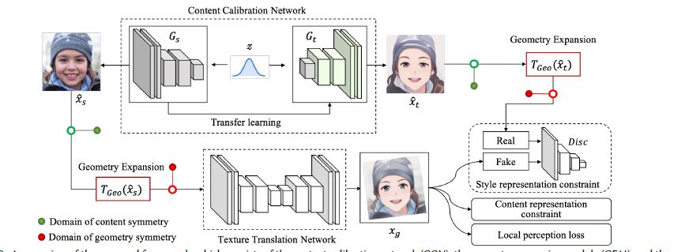
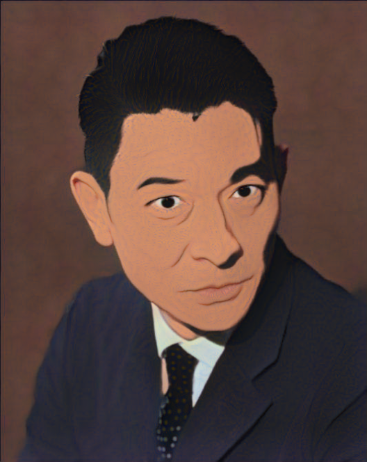

# DCT-NET.Pytorch
unofficial implementation of DCT-Net: Domain-Calibrated Translation for Portrait Stylization.<br>
you can find official version [here](https://github.com/menyifang/DCT-Net)


## show



## environment
you can build your environment follow [this](https://github.com/rosinality/stylegan2-pytorch)<br>
```pip install tensorboardX ``` for show

## how to run
### train
download pretrain weights<br>

```shell
cd utils
bash download_weight.sh
```
follow [rosinality/stylegan2-pytorch](https://github.com/rosinality/stylegan2-pytorch) and put 550000.pt in pretrain_models
#### CCN
1. prepare the style pictures and align them<br>
    the image path is like this<br>
    style-photos/<br>
    |-- 000000.png<br>
    |-- 000006.png<br>
    |-- 000010.png<br>
    |-- 000011.png<br>
    |-- 000015.png<br>
    |-- 000028.png<br>
    |-- 000039.png<br>
2. change your own path in [ccn_config](./model/styleganModule/config.py#L7)
3. train ccn<br>
    
     ```shell
     # single gpu
     python  train.py \
     --model ccn \
    --batch_size 16 \
    --checkpoint_path checkpoint \
    --lr 0.002 \
    --print_interval 100 \
    --save_interval 100 --dist 
    ```

    ```shell
     # multi gpu
    python -m torch.distributed.launch train.py \
    --model ccn \
    --batch_size 16 \
    --checkpoint_path checkpoint \
    --lr 0.002 \
    --print_interval 100 \
    --save_interval 100 
    ```
almost 1000 steps, you can stop
#### TTN
1. prepare expression information<br>
you can follow [LVT](https://github.com/LeslieZhoa/LVT) to estimate facial landmark<br>
    ```shell
    cd utils
    python get_face_expression.py \
    --img_base '' # your real image path base,like ffhq \
    --pool_num 2 # multiprocess number \
    --LVT '' # the LVT path you put \
    --train  # train data or val data
    ```
2. prepare your generator image<br>
    ```shell
    cd utils
    python get_tcc_input.py \
    --model_path '' # ccn model path \
    --output_path '' # save path
    ```
    __select almost 5k~1w good image manually__
3. change your own path in [ttn_config](./model/Pix2PixModule/config.py#21)
    ```shell
    # like
    self.train_src_root = '/StyleTransform/DATA/ffhq-2w/img'
    self.train_tgt_root = '/StyleTransform/DATA/select-style-gan'
    self.val_src_root = '/StyleTransform/DATA/dmloghq-1k/img'
    self.val_tgt_root = '/StyleTransform/DATA/select-style-gan'
    ```
4. train tnn
    ```shell
    # like ccn single and multi gpus
    python  train.py \
    --model ttn \
    --batch_size 64 \
    --checkpoint_path checkpoint \
    --lr 2e-4 \
    --print_interval 100 \
    --save_interval 100 \
    --dist
    ```
## inference
you can follow inference.py to put your own ttn model path and image path<br>
```python inference.py```

## Credits
SEAN model and implementation:<br>
https://github.com/ZPdesu/SEAN Copyright © 2020, ZPdesu.<br>
License https://github.com/ZPdesu/SEAN/blob/master/LICENSE.md

stylegan2-pytorch model and implementation:<br>
https://github.com/rosinality/stylegan2-pytorch Copyright © 2019, rosinality.<br>
License https://github.com/rosinality/stylegan2-pytorch/blob/master/LICENSE

White-box-Cartoonization model and implementation:<br>
https://github.com/SystemErrorWang/White-box-Cartoonization Copyright © 2020, SystemErrorWang.<br>

White-box-Cartoonization model pytorch model and implementation:<br>
https://github.com/vinesmsuic/White-box-Cartoonization-PyTorch Copyright © 2022, vinesmsuic.<br>
License https://github.com/vinesmsuic/White-box-Cartoonization-PyTorch/blob/main/LICENSE

arcface pytorch model pytorch model and implementation:<br>
https://github.com/ronghuaiyang/arcface-pytorch Copyright © 2018, ronghuaiyang.<br>


